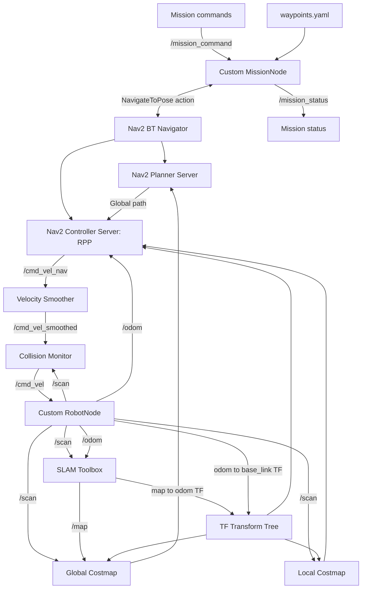

# ROS 2 Autonomous Mobile Robot

**C++ differential-drive simulation · 2D LiDAR SLAM · Nav2 navigation · Multi-waypoint missions**

A ROS 2 Jazzy mobile-robot simulation built in C++. The project combines custom robot motion and sensor models with **SLAM Toolbox** and **Navigation2 (Nav2)** for online mapping and autonomous navigation. It began with a custom grid-based A* planner and PID controller, then evolved into a Nav2-based navigation system with a custom mission manager.

> **Project scope:** This is a **simulation**, not a physical-robot deployment. The motion model, simulated sensors, original A*/PID modules, and mission manager are custom implementations. SLAM Toolbox and Nav2 are existing ROS 2 packages integrated and configured for this platform.

## Highlights

- **Custom C++ simulation:** differential-drive robot, wheel encoders, odometry, obstacle-grid world, and 360° simulated LiDAR (0.1° angular resolution; 6 m maximum range).
- **Navigation:** online 2D mapping with SLAM Toolbox; Nav2 global planning, costmaps, Regulated Pure Pursuit (RPP) control, velocity smoothing, and collision monitoring.
- **Mission management:** YAML-defined destinations, sequential `A B C D` navigation, status messages, cancellation, and basic error handling.
- **Measured LiDAR improvement:** `/scan` publishing rate increased from approximately **2.6 Hz to 10 Hz** in single-node tests without reducing angular resolution.
- **One-command startup:** integrated launch of RobotNode, SLAM Toolbox, Nav2, MissionNode, and RViz2.

## System Architecture



**Coordinate frames:** SLAM Toolbox provides the `map → odom` transform, while the robot odometry system provides `odom → base_link`. Together with the LiDAR sensor-frame transform, these let mapping and navigation components interpret measurements in their required coordinate frames.

**Verified velocity command chain:**

```text
Nav2 Controller → /cmd_vel_nav → Velocity Smoother
→ /cmd_vel_smoothed → Collision Monitor → /cmd_vel → RobotNode
```

## Implementation Overview

| Component | Responsibility | Origin |
| --- | --- | --- |
| `Robot`, `robot_node` | Differential-drive motion and ROS 2 interfaces | Custom C++ |
| `WheelEncoder`, `Odometry` | Simulated wheel measurements and odometry | Custom C++ |
| `Lidar`, `World` | Ray-casting LiDAR and obstacle queries | Custom C++ |
| `AStarPlanner` | Grid-based A* path planning | Custom C++ |
| `PIDController`, `Controller` | Original waypoint-tracking pipeline | Custom C++ |
| `slam_toolbox` | Online mapping and scan-based pose correction | Integrated package |
| `nav2_bringup` | Costmaps, planning, control, recovery, and safety | Integrated package |
| `mission_node` | Named destinations, sequential goals, status, cancellation | Custom C++ |

The **custom A*/PID pipeline** and the **Nav2 navigation pipeline** are separate implementations. Do not run the original `controller_node` alongside Nav2 if both would send commands to the same robot.

## LiDAR Performance Optimization

The initial high-resolution simulated LiDAR performed repeated trigonometric calculations and searched the obstacle grid at every ray-sampling point. During integration, its low update rate also contributed to timing and costmap message-filter issues.

Two optimizations were applied:

1. Calculate `sin` and `cos` **once per ray**, instead of at every distance sample.
2. Replace full-grid obstacle traversal in `World::isObstacle()` with **direct candidate-cell lookup**, preserving the 0.8 m square-obstacle geometry centered on integer grid coordinates.

| Stage | Angular resolution | Observed `/scan` rate |
| --- | ---: | ---: |
| Initial implementation | 0.1° | ~2.6 Hz |
| Trigonometric optimization | 0.1° | ~7.0 Hz |
| Direct candidate-cell lookup | 0.1° | ~10.0 Hz |

**Result:** Approximately **3.85× higher observed publishing rate** at the same angular resolution. These are ROS 2 topic-frequency observations from single-node tests, **not** isolated CPU benchmarks or comprehensive full-stack latency measurements.

## Mission Management

`mission_node` loads named destinations from `src/my_robot/config/waypoints.yaml` at startup. The launch file supplies the installed configuration path through the `waypoints_file` ROS 2 parameter.

Example configuration (coordinates in the `map` frame; `yaw` in radians):

```yaml
waypoints:
  A: {x: 1.0, y: 0.0, yaw: 0.0}
  B: {x: -0.02, y: 1.05, yaw: 0.0}
  C: {x: 0.0, y: 3.0, yaw: 0.0}
  D: {x: 3.0, y: 3.0, yaw: 0.0}
```

For `A B C D`, MissionNode validates the names, sends the first Nav2 `NavigateToPose` goal, and sends the next goal **only after the previous goal succeeds**. A failed or canceled goal stops the remaining sequence.

| Interface | Type | Purpose |
| --- | --- | --- |
| `/mission_command` | `std_msgs/msg/String` | Destination sequence or `CANCEL` |
| `/mission_status` | `std_msgs/msg/String` | Task progress and outcome |
| `/navigate_to_pose` | `nav2_msgs/action/NavigateToPose` | Navigation goal and result |

Example status sequence:

```text
MISSION_STARTED
NAVIGATING_TO_A
REACHED_A
NAVIGATING_TO_B
REACHED_B
NAVIGATING_TO_C
REACHED_C
NAVIGATING_TO_D
REACHED_D
MISSION_COMPLETED
```

Additional statuses include `MISSION_BUSY`, `CANCEL_REQUESTED`, `MISSION_CANCELED`, `EMPTY_MISSION`, `UNKNOWN_WAYPOINT_E`, `NAV2_NOT_READY`, and `MISSION_FAILED`.

**Tested:** Four-waypoint navigation, busy-state protection, cancellation, starting a new mission after cancellation, invalid destination names, empty commands, invalid destinations in a sequence, and unavailable Nav2 handling. A deliberately induced Nav2 planning/execution failure has **not** been conclusively documented.

## Requirements

- Ubuntu environment with **ROS 2 Jazzy** installed
- C++ compiler, CMake, `colcon`, `ament_cmake`
- SLAM Toolbox, Nav2, RViz2, and `yaml-cpp`
- ROS 2 dependencies declared in `src/my_robot/package.xml`

Example dependency preparation on a compatible Ubuntu / ROS 2 Jazzy installation:

```bash
sudo apt update
sudo apt install -y \
  python3-colcon-common-extensions python3-rosdep \
  ros-jazzy-slam-toolbox ros-jazzy-nav2-bringup \
  ros-jazzy-rviz2 libyaml-cpp-dev
```

If `rosdep` has not yet been initialized on your machine, initialize it once, then run:

```bash
sudo rosdep init  # Skip if already initialized
rosdep update
```

After cloning the repository, install remaining declared dependencies from the repository root:

```bash
source /opt/ros/jazzy/setup.bash
rosdep install --from-paths src --ignore-src -r -y --rosdistro jazzy
```

## Build

**Repository layout:** This repository is a **ROS 2 workspace root**, containing `src/my_robot/`. Clone it as its own directory, **not** inside another workspace's `src/` directory.

```bash
cd ~
git clone https://github.com/Zengweiji1645/ros2-autonomous-mobile-robot.git
cd ros2-autonomous-mobile-robot
source /opt/ros/jazzy/setup.bash
colcon build --symlink-install
source install/setup.bash
```

## Run

**Terminal 1 — start the complete system and keep it running:**

```bash
cd ~/ros2-autonomous-mobile-robot
source /opt/ros/jazzy/setup.bash
source install/setup.bash
ros2 launch my_robot robot_system.launch.py
```

If using the original development workspace, replace `~/ros2-autonomous-mobile-robot` with `~/ros2_ws`.

The launch file starts RobotNode, SLAM Toolbox, Nav2, MissionNode, and RViz2. Wait for the map and Nav2 to be ready before sending navigation commands. In online SLAM mode, selected destinations must lie in mapped, navigable space.

**Terminal 2 — send a mission:**

```bash
source /opt/ros/jazzy/setup.bash

# Navigate to one destination
ros2 topic pub --once /mission_command std_msgs/msg/String "{data: 'B'}"

# Visit four destinations in sequence
ros2 topic pub --once /mission_command std_msgs/msg/String "{data: 'A B C D'}"

# Cancel the current mission
ros2 topic pub --once /mission_command std_msgs/msg/String "{data: 'CANCEL'}"
```

**Terminal 3 — monitor status (optional):**

```bash
source /opt/ros/jazzy/setup.bash
ros2 topic echo /mission_status
```

Press `Ctrl+C` in Terminal 1 to stop the processes managed by the launch file.

## Repository Layout

```text
.
├── README.md
├── docs/
│   └── demo/
│       └── multi_waypoint_navigation.mp4
└── src/
    └── my_robot/
        ├── CMakeLists.txt
        ├── package.xml
        ├── config/
        │   ├── slam.yaml
        │   ├── nav2_params.yaml
        │   └── waypoints.yaml
        ├── launch/
        │   └── robot_system.launch.py
        ├── rviz/
        │   └── rviz2.rviz
        ├── include/my_robot/
        └── src/
            ├── robot_node.cpp
            ├── mission_node.cpp
            ├── Lidar.cpp
            ├── World.cpp
            ├── AStarPlanner.cpp
            ├── PIDController.cpp
            └── ...
```

## Demo

### A/B/C/D Multi-Waypoint Navigation

The recorded demonstration shows the simulated robot navigating through sequential destinations using SLAM Toolbox, Nav2, and the custom MissionNode, with task-status output.

**[▶ Watch the multi-waypoint navigation demo](docs/demo/multi_waypoint_navigation.mp4)**

## Limitations and Future Work

- Measure navigation accuracy, repeated-trial success rate, and full-stack timing quantitatively.
- Benchmark LiDAR computation independently and evaluate more efficient ray-grid traversal or separate sensor update scheduling.
- Improve timeout handling and behavior when a cancellation request is rejected or never resolved.
- Save maps and support repeatable fixed-waypoint localization across restarts.
- Add annotated RViz screenshots to complement the recorded demo.

> **Attribution:** SLAM Toolbox and Nav2 are integrated third-party packages. This project does not claim to reimplement their internal SLAM, planning, or controller algorithms.
