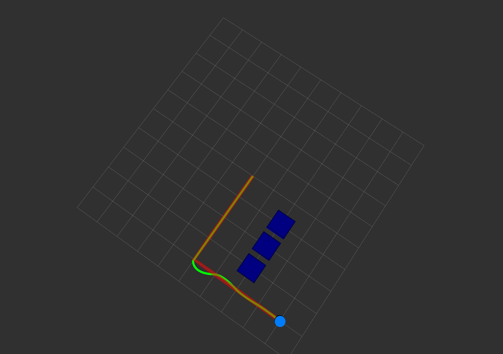

# ROS 2 Autonomous Mobile Robot

A ROS 2 autonomous mobile robot project implemented in C++.

The project integrates A* path planning, waypoint tracking, PID feedback control, TF coordinate transforms, and RViz visualization.

## Demo



## System Architecture

Grid Map
   ↓
A* Path Planner
   ↓
Waypoints
   ↓
PID Controller
   ↓
/cmd_vel
   ↓
Robot Model
   ↓
/robot_pose
   ↓
Feedback to Controller

## Features

- ROS 2 nodes implemented in C++
- Custom 2D robot motion model
- PID-based closed-loop motion control
- A* grid-based path planning implemented from scratch
- Obstacle avoidance
- Waypoint-based path tracking
- ROS 2 Publisher / Subscriber communication
- TF transform from `map` to `base_link`
- RViz visualization
  - Robot position
  - Planned A* path
  - Obstacles
  - Actual robot trajectory

## Path Planning

The planner uses a 2D occupancy grid:

- `0`: free space
- `1`: obstacle

A* evaluates nodes using:

f(n) = g(n) + h(n)

where:

- `g(n)` is the cost from the start node
- `h(n)` is the Manhattan-distance heuristic to the goal
- `f(n)` is the estimated total cost

The generated path is converted into a sequence of waypoints for the controller.

## Control

The controller uses PID feedback control to generate:

- Linear velocity `v`
- Angular velocity `omega`

The robot follows each waypoint sequentially and switches to the next waypoint when the current target is reached.

## ROS 2 Topics

| Topic | Purpose |
|---|---|
| `/cmd_vel` | Linear and angular velocity commands |
| `/robot_pose` | Robot position and orientation |
| `/robot_marker` | Robot visualization in RViz |
| `/planned_path` | A* planned path |
| `/obstacles` | Grid-map obstacle visualization |
| `/actual_trajectory` | Actual robot trajectory |

## TF

Current TF structure:

map
└── base_link

`map` represents the global reference frame, while `base_link` represents the robot body frame.

## Build

```bash
cd ~/ros2_ws
colcon build
source install/setup.bash
