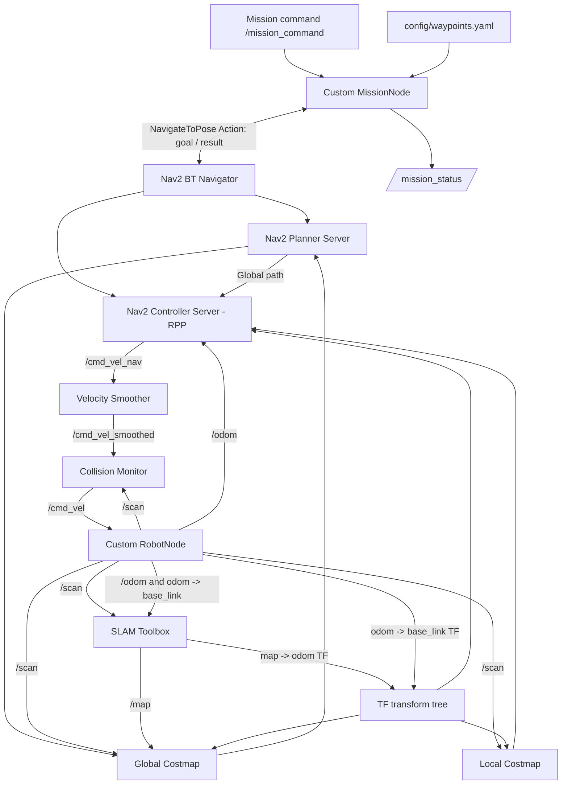

# ROS 2 Autonomous Mobile Robot

**C++ differential-drive robot simulation | 2D LiDAR SLAM | Nav2 navigation | Multi-waypoint missions**

A ROS 2 Jazzy project that connects a custom-built mobile robot simulator to **SLAM Toolbox** and **Navigation2 (Nav2)**. It began with an independently implemented grid-based A\* planner and PID controller, then evolved into an integrated mapping and autonomous-navigation system with a C++ mission manager.

> **Scope:** This is a **simulated robot**, not a physical hardware deployment. The robot motion, simulated sensors, original A\* / PID components, and mission manager are project implementations. SLAM Toolbox and Nav2 are third-party ROS 2 packages integrated and configured for this platform.

## Features

- Differential-drive motion simulation and a configurable obstacle-grid world
- Simulated wheel encoders and wheel odometry (`/odom`)
- 360-degree, 0.1-degree-resolution ray-casting LiDAR (`/scan`, nominal 6 m range)
- Independently implemented grid-based A\* path planning and PID-based waypoint tracking
- Online 2D mapping with SLAM Toolbox (`/map`, `map -> odom`)
- Nav2 global planning, local costmaps, Regulated Pure Pursuit (RPP) tracking, velocity smoothing, and collision monitoring
- YAML-configured named waypoints and sequential missions (`A B C D`)
- Mission cancellation, busy-state protection, validation, and status publication
- One-command launch for the robot, SLAM, Nav2, mission manager, and RViz2

## Architecture



**Coordinate frames:** SLAM Toolbox estimates the global correction `map -> odom`. Robot odometry supplies `odom -> base_link`. These transforms compose to provide the robot pose in the map frame. The LiDAR's sensor frame is connected to the robot through TF.

**Command chain (verified in ROS 2 node inspection):**

```text
Nav2 controller -> /cmd_vel_nav -> velocity_smoother
-> /cmd_vel_smoothed -> collision_monitor -> /cmd_vel -> robot_node
```

## Implemented Components

| Component                     | Responsibility                                                           | Implementation     |
| ----------------------------- | ------------------------------------------------------------------------ | ------------------ |
| `Robot`, `robot_node`         | Simulated differential-drive motion and ROS 2 interface                  | Custom C++         |
| `WheelEncoder`, `Odometry`    | Wheel measurements and odometry estimates                                | Custom C++         |
| `Lidar`, `World`              | Ray-casting laser measurements and obstacle queries                      | Custom C++         |
| `AStarPlanner`                | Grid-based A\* search (original navigation implementation)               | Custom C++         |
| `PIDController`, `Controller` | Original waypoint-tracking control                                       | Custom C++         |
| `slam_toolbox`                | Online mapping and scan-based global localization correction             | Integrated package |
| `nav2_bringup`                | Costmaps, global planning, path following, recovery, and safety pipeline | Integrated package |
| `mission_node`                | Named waypoint lookup, sequential goals, results, and cancellation       | Custom C++         |

The custom A\* / PID pipeline and the Nav2 pipeline are **separate implementations**. Do not run the original `controller_node` concurrently with Nav2 when both could command the robot.

## LiDAR Performance Optimization

During integration, the high-resolution simulated LiDAR slowed the shared robot update loop and contributed to TF-timing and costmap message-filter warnings.

Two changes reduced the work per scan:

1. Compute `sin` and `cos` once per ray rather than for every distance sample.
2. Use a direct candidate-grid-cell lookup in `World::isObstacle()` instead of traversing the full obstacle grid for every sample. The geometry check retains the original 0.8 m square obstacles centered on integer grid coordinates.

| Stage                                                  | Angular resolution | Observed `/scan` publishing rate |
| ------------------------------------------------------ | -----------------: | -------------------------------: |
| Initial implementation                                 |               0.1° |                         \~2.6 Hz |
| Trigonometric calculations moved outside sampling loop |               0.1° |                           \~7 Hz |
| Direct candidate-cell obstacle lookup                  |               0.1° |                          \~10 Hz |

**Result:** Approximately **3.85x higher observed publish rate** in the recorded test, while keeping the same angular resolution. These are ROS 2 topic-frequency measurements, not isolated CPU benchmarks. Full-stack timing under all workloads has not been quantified.

## Mission Management

Named targets are loaded from `src/my_robot/config/waypoints.yaml` at startup. The launch file passes the installed configuration path to MissionNode using the `waypoints_file` ROS 2 parameter.

Example waypoint definitions (map-frame coordinates; yaw in radians):

```yaml
waypoints:
  A: {x: 1.0, y: 0.0, yaw: 0.0}
  B: {x: -0.02, y: 1.05, yaw: 0.0}
  C: {x: 0.0, y: 3.0, yaw: 0.0}
  D: {x: 3.0, y: 3.0, yaw: 0.0}
```

For a command such as `A B C D`, MissionNode checks the names, sends the first `NavigateToPose` goal, and sends the next goal only after the previous goal succeeds. A failed or canceled goal ends the remaining sequence.

**Interfaces**

| Interface           | Message / Action                  | Purpose                           |
| ------------------- | --------------------------------- | --------------------------------- |
| `/mission_command`  | `std_msgs/msg/String`             | Named target sequence or `CANCEL` |
| `/mission_status`   | `std_msgs/msg/String`             | Task state and outcome            |
| `/navigate_to_pose` | `nav2_msgs/action/NavigateToPose` | Navigation goal and result        |

Example statuses: `MISSION_STARTED`, `NAVIGATING_TO_A`, `REACHED_A`, `MISSION_COMPLETED`, `MISSION_BUSY`, `CANCEL_REQUESTED`, `MISSION_CANCELED`, `EMPTY_MISSION`, `UNKNOWN_WAYPOINT_E`, `NAV2_NOT_READY`, and `MISSION_FAILED`.

**Tested:** Four-waypoint sequential navigation, rejection of new missions while busy, cancellation, starting a new mission after cancellation, invalid waypoint names, empty commands, invalid waypoint in a sequence, and Nav2-unavailable handling. A deliberately induced Nav2 execution/planning failure has not been conclusively documented.

## Requirements

- Ubuntu environment with **ROS 2 Jazzy** installed and sourced
- C++ compiler, CMake, `colcon`, and `ament_cmake`
- ROS 2 dependencies declared in `src/my_robot/package.xml`
- `slam_toolbox`, `nav2_bringup`, `rviz2`, and `libyaml-cpp-dev`

For an Ubuntu / ROS 2 Jazzy setup, typical dependency preparation is:

```bash
sudo apt update
sudo apt install -y \
  python3-colcon-common-extensions python3-rosdep \
  ros-jazzy-slam-toolbox ros-jazzy-nav2-bringup \
  ros-jazzy-rviz2 libyaml-cpp-dev
```

If `rosdep` has not been initialized on the machine, initialize it once, then update it. Run dependency installation from the workspace root:

```bash
sudo rosdep init   # only on machines where rosdep has not been initialized
rosdep update
rosdep install --from-paths src --ignore-src -r -y --rosdistro jazzy
```

## Build

**Important:** The repository is organized as a **workspace root**, containing `src/my_robot/`. Clone it into a new workspace directory, **not** inside an existing workspace's `src/` directory.

```bash
cd ~
git clone https://github.com/Zengweiji1645/ros2-autonomous-mobile-robot.git ros2-autonomous-mobile-robot
cd ros2-autonomous-mobile-robot
source /opt/ros/jazzy/setup.bash
colcon build --symlink-install
source install/setup.bash
```

For an existing checkout at `~/ros2_ws`, use `cd ~/ros2_ws` instead.

## Run: One Command

**Terminal 1 — keep running:**

```bash
cd ~/ros2_ws
source /opt/ros/jazzy/setup.bash
source install/setup.bash
ros2 launch my_robot robot_system.launch.py
```

For a workspace cloned under a different directory, replace `~/ros2_ws` with that directory.

The launch file starts the robot simulation, online SLAM, Nav2, MissionNode, and RViz2. Wait for the map and Nav2 to become ready before sending missions. In online SLAM mode, mapped free space must include the selected waypoints.

**Terminal 2 — send commands:**

```bash
source /opt/ros/jazzy/setup.bash

# Single waypoint
ros2 topic pub --once /mission_command std_msgs/msg/String "{data: 'B'}"

# Sequential mission
ros2 topic pub --once /mission_command std_msgs/msg/String "{data: 'A B C D'}"

# Cancel current mission
ros2 topic pub --once /mission_command std_msgs/msg/String "{data: 'CANCEL'}"
```

**Terminal 3 — monitor status (optional):**

```bash
source /opt/ros/jazzy/setup.bash
ros2 topic echo /mission_status
```

Press `Ctrl+C` in Terminal 1 to stop the launch-managed processes.

## Configuration and Repository Layout

```text
.
├── README.md
├── src/
│   └── my_robot/
│       ├── CMakeLists.txt
│       ├── package.xml
│       ├── config/
│       │   ├── slam.yaml
│       │   ├── nav2_params.yaml
│       │   └── waypoints.yaml
│       ├── launch/
│       │   └── robot_system.launch.py
│       ├── rviz/
│       │   └── rviz2.rviz
│       ├── include/my_robot/
│       └── src/
│           ├── robot_node.cpp
│           ├── mission_node.cpp
│           ├── Lidar.cpp
│           ├── World.cpp
│           ├── AStarPlanner.cpp
│           ├── PIDController.cpp
│           └── ...
```

- `config/slam.yaml`: SLAM Toolbox settings
- `config/nav2_params.yaml`: Nav2 planning, controller, and costmap settings
- `config/waypoints.yaml`: named destinations in the SLAM map frame
- `launch/robot_system.launch.py`: integrated system startup
- `rviz/rviz2.rviz`: RViz configuration available in the repository

**Mapping caveat:** Online SLAM does not automatically guarantee the same map-frame alignment after every restart. Named waypoints must be checked against the current map; persistent fixed-site navigation would benefit from saving the map and using a consistent localization setup.

## Demonstration

The project has been exercised with a four-stop mission (`A -> B -> C -> D`) and ROS 2 mission-state outputs. RViz screenshots and a recorded demonstration can be added here when available.

\<!-- Add your own screenshots/videos, for example:
![SLAM and navigation]\(docs/images/navigation.png)
[Mission demonstration]\(docs/videos/mission-demo.mp4)
\-->

## Limitations and Future Work

- Quantify navigation accuracy, task success rates, and full-stack latency over repeated trials.
- Benchmark LiDAR processing independently and consider grid-traversal ray casting or decoupled sensor update scheduling.
- Improve mission timeout and cancellation-rejection handling.
- Save maps and support repeatable fixed-waypoint localization across restarts.
- Add RViz screenshots and a reproducible video demonstration.

---

**Implementation attribution:** The project integrates existing SLAM Toolbox and Nav2 packages; it does not claim to reimplement their internal SLAM, global-planning, or controller algorithms.
